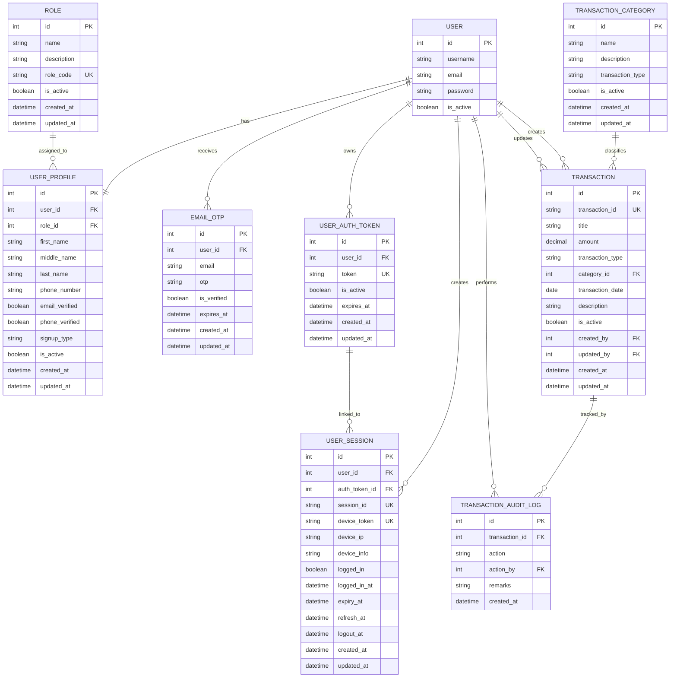
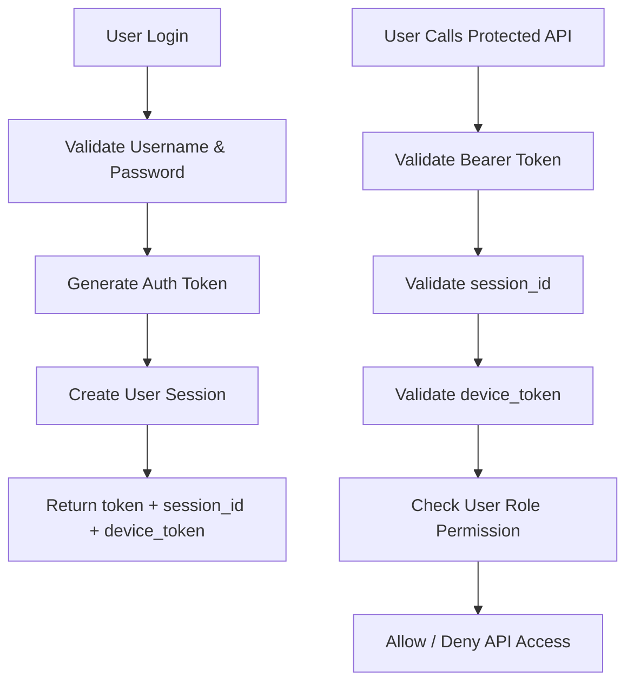

# FinanceHub

## 1. Overview

FinanceHub is a Django-based backend system built for a finance dashboard use case where different users interact with financial records based on their role and access level.

The project focuses on core backend responsibilities such as:
- user and role management
- authentication and session handling
- transaction and category management
- reporting and summary analytics
- validation and access control

This project was developed as part of a backend assignment centered on API design, data modeling, business logic, and access control.

## 2. Tech Stack

<table>
  <tr>
    <th align="left">Component</th>
    <th align="left">Technology</th>
  </tr>
  <tr>
    <td>Backend Framework</td>
    <td>Django</td>
  </tr>
  <tr>
    <td>API Framework</td>
    <td>Django REST Framework</td>
  </tr>
  <tr>
    <td>Database</td>
    <td>PostgreSQL</td>
  </tr>
  <tr>
    <td>Authentication</td>
    <td>Token + Session Based Authentication</td>
  </tr>
  <tr>
    <td>Email Service</td>
    <td>Brevo SMTP</td>
  </tr>
  <tr>
    <td>Testing</td>
    <td>Pytest + Factory Boy</td>
  </tr>
  <tr>
    <td>Language</td>
    <td>Python</td>
  </tr>
</table>

## 3. Project Structure

```bash
FinanceEHub/
│
├── config/                  # Django project configuration
├── services/
│   ├── reporting/           # Dashboard and reporting APIs
│   ├── transactions/        # Transaction and category management
│   └── users/               # User, role, authentication, and session logic
│
├── utilities/               # Constants, helpers, response format, common utilities
├── venv/
├── .env
├── .gitignore
├── manage.py
└── requirements.txt
```

## 4. Database Architecture

The backend uses a relational database design in PostgreSQL and is organized into three main service areas:

- **Users** → role management, authentication, OTP, and sessions
- **Transactions** → transaction categories, transaction records, and audit logs
- **Reporting** → generated dynamically from transaction data (no separate reporting tables)

### Entity Relationship Diagram



## 5. Authentication and Session Flow



## 6. Architecture Pattern

<table>
  <tr>
    <th align="left">Layer</th>
    <th align="left">Responsibility</th>
  </tr>
  <tr>
    <td><code>api.py</code></td>
    <td>Handles request parsing and response return</td>
  </tr>
  <tr>
    <td><code>helpers.py</code></td>
    <td>Contains business logic and validations</td>
  </tr>
  <tr>
    <td><code>models.py</code></td>
    <td>Defines database schema</td>
  </tr>
  <tr>
    <td><code>utilities</code></td>
    <td>Stores constants, common functions, and response helpers</td>
  </tr>
</table>

This structure keeps the code modular, readable, and easier to maintain.

## 7. Core Features

### User and Access Management
- Role-based access control using Admin, Analyst, and Client roles
- User creation and management
- Active and inactive user handling
- Email OTP verification during signup

### Authentication and Session Handling
- Login using username and password
- Token generation after login
- Session creation using `session_id` and `device_token`
- Session validation for protected APIs
- Logout support

### Transactions Management
- Create, update, fetch, and delete transactions
- Create, update, and fetch transaction categories
- Filter transactions using date, category, type, and search
- Soft delete support for transactions
- Audit logging for transaction actions

### Reporting and Dashboard
- Total income
- Total expenses
- Net balance
- Category-wise summary
- Monthly transaction trend
- Recent transaction activity
- Transaction audit logs

### Validation and Reliability
- Structured error handling
- Required field validations
- Role-based authorization
- Invalid token and invalid session protection


## 8. Database Design

### Users Module
- `Role`
- `UserProfile`
- `EmailOTP`
- `UserAuthToken`
- `UserSession`

### Transactions Module
- `TransactionCategory`
- `Transaction`
- `TransactionAuditLog`

### Reporting Module
- Reporting is generated dynamically from transaction data
- No separate reporting tables are used for this assignment scope


## 9. Setup Instructions

### Clone the repository

```bash
git clone <repository_url>
cd FinanceHub
```

### Create and activate virtual environment

**Windows**

```bash
python -m venv venv
venv\Scripts\activate
```

**Linux / Mac**

```bash
python -m venv venv
source venv/bin/activate
```

### Install dependencies

```bash
pip install -r requirements.txt
```

### Configure environment variables

Create a `.env` file and add the required values:

```bash
DATABASE_NAME=
DATABASE_USER=
DATABASE_PASSWORD=
DATABASE_HOST=
DATABASE_PORT=

EMAIL_HOST=
EMAIL_PORT=
EMAIL_HOST_USER=
EMAIL_HOST_PASSWORD=
```

### Run migrations

```bash
python manage.py makemigrations
python manage.py migrate
```

## Start the development server

```bash
python manage.py runserver
```

## 10. Running Unit Tests

```bash
pytest
```

Unit tests are written using:

`pytest`

`pytest-django`

`factory_boy`

## 11. Possible Improvements

- Export reports to Excel or PDF
  
- Add recurring transactions support

- Introduce budget planning functionality
  
- Add charts and richer dashboard analytics
  
- Add Docker support
  
- Add rate limiting for APIs
  
- Add caching for reporting endpoints
  
- Add deployment configuration for cloud hosting
  
- Expand unit and integration test coverage

## 12. Summary

FinanceHub is a modular backend project designed to demonstrate:

- clean API design
  
- layered architecture
  
- access control logic
  
- transaction management
  
- reporting and aggregation
  
- validation and error handling
  
- maintainable project structure

It is built to satisfy the requirements of a finance data processing and access control backend assignment with a practical and structured implementation.
